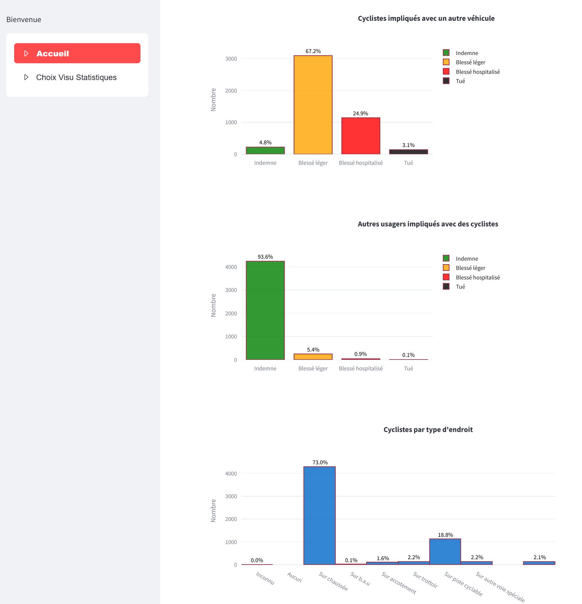

# Projet_Accidentologie
Projet pour la formation Chef de Projet IA à la Wild Code School

## **_Étude de la gravité des accidents corporels des cyclistes en France_**

D'après une idée de :
[Défis data gouv](https://defis.data.gouv.fr/defis/infrastructures-cyclables)

Et en s'inspirant de : [larevuia.fr](https://larevueia.fr/xgboost-vs-random-forest-predire-la-gravite-dun-accident-de-la-route/)

Données de la base des accidents corporels de la circulation routière : [datasets](https://www.data.gouv.fr/fr/datasets/bases-de-donnees-annuelles-des-accidents-corporels-de-la-circulation-routiere-annees-de-2005-a-2023/)

Mise en ligne sur une application Streamlit : [Accidentologie des cyclistes](https://accidentologie-cyclistes.streamlit.app/)

TODO :
- ajouter datasets des années antérieures à 2023
- ML
- appli Streamlit : ajouter choix : métropole / outre-mer / département
